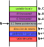

# Factorial recursivo
- Adián Martín &copy; 2022

 Disclaimers 

- Tanto el código del factorial en C++ como el de la solución propuesta en ensamblador ARM son mejorables en lo que respecta a la implementación (existencia de comprobaciones innecesarias, reserva evitable de espacio en memoria,...). Este ejemplo busca ser didáctico y presentar la traducción de alto nivel a ensamblador de la manera más explícita y directa posible, por lo que con la solución propuesta no se busca la eficiencia ni en tiempo de ejecución ni en memoria utilizada. No obstante, una versión más simplificada (aunque todavía optimizable) del código fuente puede encontrarse aquí ([código c++](src/FUNfactorial_optimizada.cpp), [código ensamblador](src/SBRfactorial_optimizada.s), [diagrama del bloque de activación](images/BAfactorial_optimizada.svg)).
- En la implementación de la subrutina no se sigue el standard *APCS* (*ARM Procedure Call Standard*), pues como ya se ha comentado, se busca simplificar el ejercicio y ceñirse a lo que se exige en la asignatura del grado

________________________________________________________
## Enunciado

Implementa [la siguiente función *C++*](src/FUNfactorial.cpp) (cálculo recursivo del factorial) como una subrutina en ensamblador *ARMv4*, y dibuja el bloque de activación de una invocación a ella.

<pre>
<code class="language-cpp">
/* Pre: n ≥ 0
 * Post: factorial(n) = (Πα∈[1,n].α)
 */
int factorial(const int n) {
	int r;
	if (n == 0) {
		// caso base: n = 0 -> factorial(0) = 1
		r = 1;
	}
	else {
		// caso recurrente: n > 0 -> factorial(n) = n * factorial(n-1)
		r = n * factorial(n-1);
	}
	return r;
}

//---------------------------------------
// Ejemplo de uso (invocación con n = 5)
int main(){
	int n = 5;
	int s = 0;
	s = factorial(n);
	while(1){;} // espera activa (no hay sistema operativo)
}
</code>
</pre>

<button data-bs-toggle="collapse" data-bs-target="#respuesta">Mostrar solución</button>

### Solución propuesta

A la hora de llevar a cabo la traducción, el primer paso es definir cómo debe ser el interfaz de una llamada a la subrutina desde el procedimiento invocante. En este caso, se propone la siguiente implementación para la función *main* de *C++*:

<pre>
<code class="language-armasm">
; Programa principal
		mov r0,#n			; r0 = n
		; invocación a factorial
		sub sp,sp,#4		; reservo espacio para resultado
		PUSH{r0}			; apilo parámetro n por valor
		bl factorial		; invocación a la función factorial
		add sp,sp,#4		; libero espacio del parámetro
		; almacenamiento del resultado
		POP{r0}				; desapilo en r0 el resultado de factorial
		LDR r1,=s			; r1 tiene la dirección de la variable s
		str r0,[r1]			; almaceno resultado asignando valor devuelto por factorial a variable s

fin		b fin				; fin programa principal
</code>
</pre>

Como se puede observar, el procedimiento invocante primero reserva 4 bytes en la pila, en los cuales la subrutina deberá almacenar el valor devuelto. A continuación, apila el valor de *n* con el que se invoca a la función (paso de parámetro por valor).

Justo después de la instrucción *branch and link* el *stack pointer* deberá apuntar a la misma posición de memoria que antes de la llamada a la subrutina, es decir, deberá apuntar al parámetro *n* de la llamada dentro de la pila. Por ello, lo primero que hace el procedimiento invocante tras el retorno es mover el *stack pointer* para liberar el espacio ocupado por el argumento de la invocación. Después, desapila los siguientes 4 bytes en un registro, recuperando así el resultado de la ejecución de la subrutina. Las instrucciones posteriores simplemente escriben ese valor en la posición de memoria correspondiente a la variable *s* de alto nivel.

Una vez está claro el interfaz de la subrutina con el procedimiento invocante, se pasa a implementar la subrutina como tal. Lo primero que debe hacer una subrutina es salvar el contenido de aquellos registros que vaya a modificar, pues tras el retorno al procedimiento invocante, éste debe ver preservados los valores que tenían antes de la invocación. Así, se deben salvar:
- El *link register*, que almacena la dirección de retorno (posición de memoria de la siguiente instrucción del procedimiento invocante que debe ejecutarse tras la invocación a la subrutina).
  
  Si la subrutina no realizase ninguna invocación dentro de su código, el contenido de este registro podría no salvarse, pues no sería modificado (función hoja). No obstante, al tratarse de una función recursiva, es necesario preservarlo, pues se reescribirá en el momento en el que se realice la primera invocación recursiva.
- El *frame pointer*, que sirve como punto de referencia dentro del bloque de activación actual para acceder a los valores almacenados en la pila.
  
  En el momento de la invocación, el registro *r11* (que cumple la función de *frame pointer*) almacena el valor del *frame pointer* del procedimiento invocante, y por lo tanto, debe preservarse antes de sobreescribirlo con el valor del *frame pointer* del bloque de activación de la subrutina.
- Los registros de propósito general que vayan a utilizarse y, por lo tanto, su valor vaya a verse modificado. En este caso, solo será necesario salvar los registros *r0* y *r1*.
- El propio *stack pointer* tras el retorno de la subrutina deberá apuntar a la misma posición que antes de la invocación. No obstante, dado que su valor se gestiona mediante la política LIFO que rige la propia pila, bastará con asegurarse de destruir la parte del bloque de activación por encima de los parámetros de la subrutina antes de efectuar el retorno.

Por último, habrá que determinar el espacio que es necesario reservar para las variables locales de la subrutina:
- En este caso, solo hay una variable local de alto nivel; la variable *r*. Si bien podría almacenarse en cualquiera de los registros de propósito general de los que se dispone, en este ejemplo, para ilustrar cómo se almacenan las variables locales en la pila, se le reservará espacio en ella.

Así, queda un bloque de activación como el siguiente:

Las instrucciones con las que se empieza y termina cada subrutina apenas varían, pues siempre consisten en aplicar las ideas que se han mencionado. Es por ello que a las instrucciones del principio, que se encargan de salvar los registros que se van a utilizar y preparar el marco de pila, se las llama prólogo de la subrutina, y a las que destruyen el marco de pila y restauran el contenido de los registros antes de retornar al procedimiento invocante se las llama epílogo de la subrutina. Será entre el prólogo y el epílogo donde se ubicará el código correspondiente a la implementación de la funcionalidad de la subrutina como tal.

A continuación, se propone una implementación para la subrutina:

<pre>
<code class="language-armasm">
; Subrutina factorial
		   ; gestión del bloque de activación
factorial	PUSH{lr}			; apilo dirección de retorno
			PUSH{r11}			; apilo r11
			mov fp,sp			; creación del frame pointer
			PUSH{r0-r1}			; apilo registros que voy a utilizar
			sub sp,sp,#4		; reservo espacio para variable local r

			ldr r0,[fp,#8]		; r0 = n
			cmp r0,#0			; n == 0 ?
			bne else			; n != 0 -> branch else
			; n == 0
			mov r0,#1			; r0 = 1
			str r0,[fp,#-0xC]	; r = 1
			b fins				; fin de if
			; n != 0
else		sub r1,r0,#1		; r1 = n - 1
			; invocaci�n recursiva
			sub sp,sp,#4		; reservo espacio para el resultado
			PUSH{r1}			; apilo parámetro por valor n-1
			bl factorial
			add sp,sp,#4		; libero espacio del parámetro
			POP{r1}				; r1 = factorial(n-1)
			mul r1,r0,r1		; r1 = n * factorial(n-1)
			str r1,[fp,#-0xC]	; r = r1
			; fin else

fins		ldr r0,[fp,#-0xC]	; r0 = r
			str r0,[fp,#0xC]	; return r => devolución de factorial
			add sp,sp,#4		; destruyo variable local r
			POP{r0-r1}			; desapilo valores iniciales de los registros utilizados
			POP{r11}			; recupero valor de r11
			POP{pc}				; retorno de la SBR
; FIN Subrutina factorial
</code>
</pre>

El código completo de la solución propuesta puede encontrarse [aquí](src/SBRfactorial.s).

